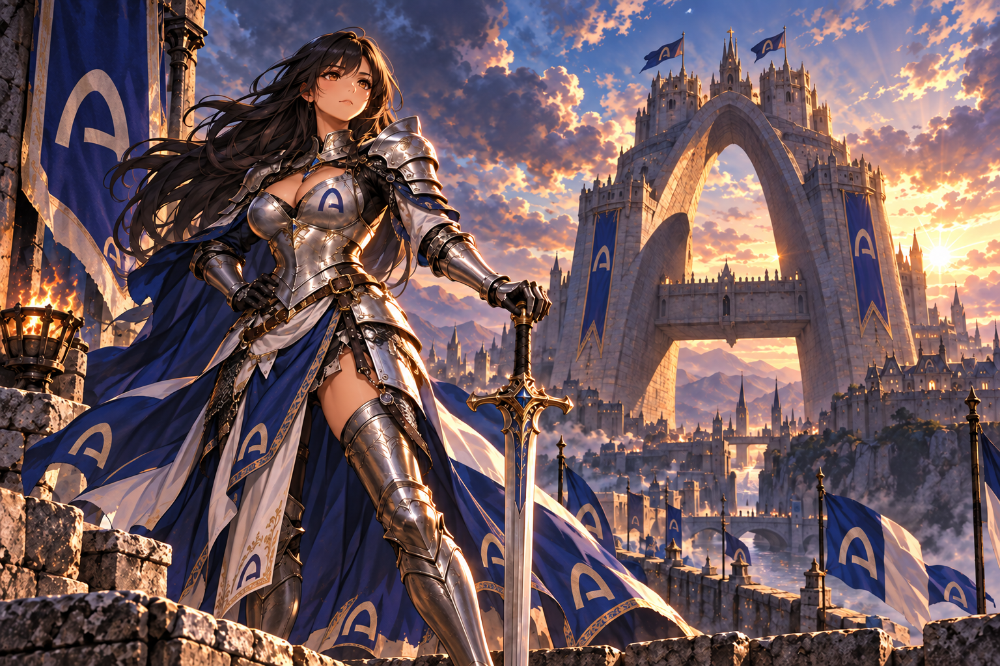

# J7C — Building in Public

Joan of ARC ($J7C) combines a Joan-of-Arc-inspired character with venture-capital satire on Arc. This is our public notebook: what we changed, what we learned, and what we still need to verify.

J7C is human-owned and AI-assisted. The project is an independent parody and has no affiliation with or endorsement from a16z. This notebook does not promise token returns or milestone completion.

## Contents

- [Arc Chan case study](archan-case-study.md): what public evidence supports and what it cannot prove.
- [Changelog](changelog.md): dated updates to this public record.
- [Update template](update-template.md): the evidence standard for future entries.

## Primary public links

- J7C Argus page: https://argus.world/token/0x4060e632bBb7D731d50fA8Fc58C82D93154085c1
- J7C X account: https://x.com/J7Cofficial
- J7C GeckoTerminal pool: https://www.geckoterminal.com/arc/pools/0xf962e883fd2ab4b21e1248a7ea62835f3ae31f6103351f74dfada89d43c63c36

Network: **Arc**. Token contract: `0x4060e632bBb7D731d50fA8Fc58C82D93154085c1`.

## How to participate

Give Joan a seven-word quest, suggest a fictional investment-committee memo, or point out a factual error through [our X account](https://x.com/J7Cofficial). No token purchase is needed. We welcome useful criticism and original ideas.

Observations are dated snapshots. A displayed metric can change, be delayed, or disagree across trackers; it must not be read as a historical series without a timestamped source.

## Current visual direction

The current creative direction is an attractive adult Joan warrior guarding an Arc-inspired castle. The v2 artwork uses Arc emblems on the armor, garments, and banners, with no J7C lettering in the clothing. It is AI-assisted character art for independent VC satire; no Arc or a16z affiliation or endorsement is implied.

The scheduled caption is:

> Joan holds the gate.
>
> $J7C

Verified in the X scheduled list on September 28 at 08:20 KST for September 28, 2026 at 09:00 KST. Scheduled does not mean published.

## Earlier visual preview

AI-assisted art for an independent Joan/VC-satire concept:

See the [creative note](creative-notes.md) for the exact subtitle and disclosure. This asset makes no price, trading, return, or performance claim.

