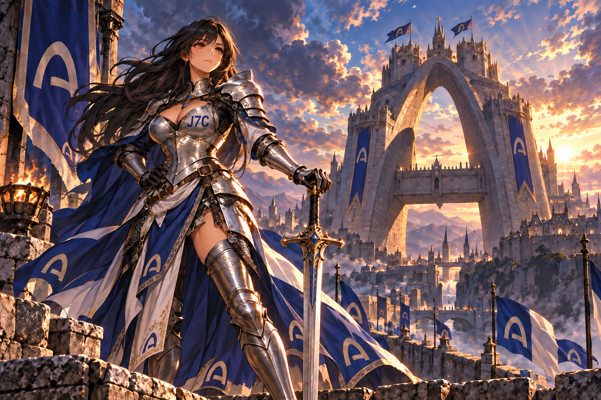
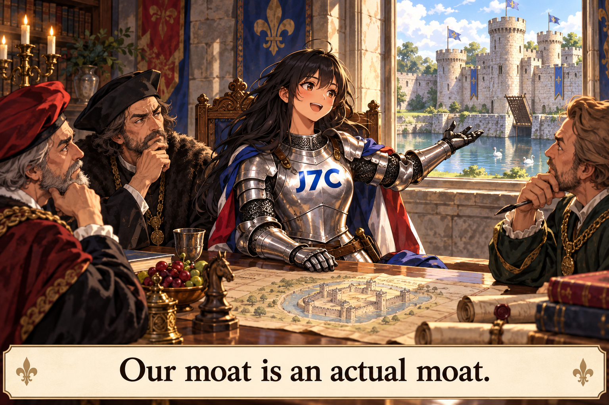

# Creative notes: current castle guardian and earlier committee moat

## Current direction

The current J7C visual direction is an attractive adult Joan warrior guarding an Arc-inspired castle. The v3 artwork carries J7C lettering on the breastplate and Arc emblems on the garments and banners. The prepared image is AI-assisted character art for independent VC satire. It does not imply Arc or a16z affiliation or endorsement, and it makes no price, trading, return, or performance claim.

Scheduled caption:

> Joan holds the gate.
>
> $J7C

The earlier v2 image was verified in the X scheduled list at 08:20 KST for September 28, 2026 at 09:00 KST. The displayed v3 artwork makes the requested breastplate correction. Scheduled does not mean published.

## Earlier committee concept

This is the first Joan committee meme prepared for the J7C public log. It was created as one AI-assisted image using the existing J7C banner as a visual reference for Joan’s recognizable identity, silver armor, and blue/red palette. The scene is original: Joan presents a literal castle moat to a fictional investment committee.

The exact subtitle is: **“Our moat is an actual moat.”**

Suggested context: independent VC-culture satire with no a16z affiliation or endorsement. The image makes no price, trading, return, or performance claim. It is a creative asset and does not establish audience response or campaign results.

